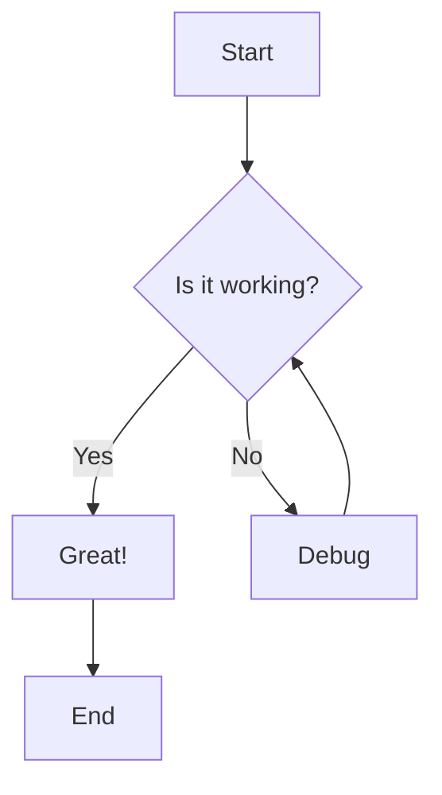
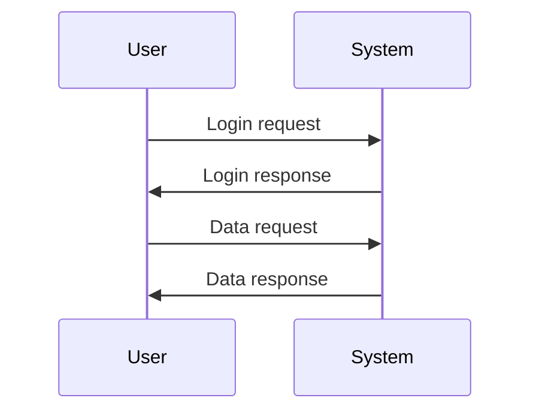

# Markdown Examples and Testing Guide

This document demonstrates various Markdown features for testing and reference.

## Table of Contents
- [Basic Formatting](#basic-formatting)
- [Lists](#lists)
- [Links and Images](#links-and-images)
- [Code](#code)
- [Tables](#tables)
- [Blockquotes](#blockquotes)
- [Task Lists](#task-lists)
- [Horizontal Rules](#horizontal-rules)
- [Extended Syntax](#extended-syntax)

## Basic Formatting

### Text Styles

**Bold text** or __bold text__

*Italic text* or _italic text_

***Bold and italic*** or ___bold and italic___

~~Strikethrough text~~

### Headings

# Heading 1
## Heading 2
### Heading 3
#### Heading 4
##### Heading 5
###### Heading 6

Alternative heading syntax:

Heading 1
=========

Heading 2
---------

## Lists

### Unordered Lists

- Item 1
- Item 2
- Item 3
  - Nested item 3.1
  - Nested item 3.2
    - Deeply nested item 3.2.1

* You can also use asterisks
+ Or plus signs

### Ordered Lists

1. First item
2. Second item
3. Third item
   1. Nested item 3.1
   2. Nested item 3.2
4. Fourth item

### Mixed Lists

1. First ordered item
   - Unordered sub-item
   - Another sub-item
2. Second ordered item
   1. Ordered sub-item
   2. Another ordered sub-item

## Links and Images

### Links

[GitHub](https://github.com)

[GitHub with title](https://github.com "Go to GitHub")

[Relative link to README](../README.md)

[Link with reference][reference-link]

[reference-link]: https://github.com "GitHub Homepage"

Automatic link: <https://github.com>

Email link: <email@example.com>

### Images


![Alt text with reference][image-ref]

[image-ref]: https://via.placeholder.com/150 "Referenced image"

## Code

### Inline Code

Use `inline code` with backticks.

Here's a command: `npm install`

### Code Blocks

```
Simple code block
No syntax highlighting
```

### Syntax Highlighted Code Blocks

#### JavaScript
```javascript
function hello(name) {
    console.log(`Hello, ${name}!`);
}

hello("World");
```

#### Python
```python
def hello(name):
    print(f"Hello, {name}!")

hello("World")
```

#### HTML
```html
<!DOCTYPE html>
<html>
<head>
    <title>Hello World</title>
</head>
<body>
    <h1>Hello, World!</h1>
</body>
</html>
```

#### CSS
```css
body {
    font-family: Arial, sans-serif;
    background-color: #f0f0f0;
    margin: 0;
    padding: 20px;
}
```

#### Bash
```bash
#!/bin/bash
echo "Hello, World!"
git status
npm install
```

#### JSON
```json
{
    "name": "example",
    "version": "1.0.0",
    "description": "A JSON example"
}
```

## Tables

### Basic Table

| Header 1 | Header 2 | Header 3 |
|----------|----------|----------|
| Row 1, Col 1 | Row 1, Col 2 | Row 1, Col 3 |
| Row 2, Col 1 | Row 2, Col 2 | Row 2, Col 3 |
| Row 3, Col 1 | Row 3, Col 2 | Row 3, Col 3 |

### Aligned Tables

| Left Aligned | Center Aligned | Right Aligned |
|:-------------|:--------------:|--------------:|
| Left         | Center         | Right         |
| Text         | Text           | Text          |
| 123          | 456            | 789           |

### Complex Table

| Feature | Description | Status |
|---------|-------------|--------|
| Markdown | Lightweight markup language | ✅ Complete |
| Tables | Organize data in rows and columns | ✅ Complete |
| Code Blocks | Display formatted code | ✅ Complete |
| Images | Embed images | ⚠️ In Progress |

## Blockquotes

> This is a simple blockquote.

> This is a blockquote
> with multiple lines.

> ### Blockquote with heading
> 
> Blockquotes can contain other Markdown elements:
> - Lists
> - **Bold text**
> - `Code`

> Nested blockquotes:
>> Second level
>>> Third level

## Task Lists

- [x] Completed task
- [x] Another completed task
- [ ] Incomplete task
- [ ] Another incomplete task
  - [x] Completed sub-task
  - [ ] Incomplete sub-task

## Horizontal Rules

Use three or more hyphens, asterisks, or underscores:

---

***

___

## Extended Syntax

### Footnotes

Here's a sentence with a footnote.[^1]

Here's another with a longer footnote.[^long-note]

[^1]: This is the footnote.

[^long-note]: This is a longer footnote with multiple paragraphs.
    
    You can add more paragraphs by indenting them.

### Definition Lists

Term 1
: Definition 1

Term 2
: Definition 2a
: Definition 2b

### Abbreviations

The HTML specification is maintained by the W3C.

*[HTML]: Hypertext Markup Language
*[W3C]: World Wide Web Consortium

### Superscript and Subscript

X^2^ (superscript)

H~2~O (subscript)

### Emojis

:smile: :heart: :thumbsup: :rocket: :tada:

😀 😃 😄 😁 🎉 🚀 ❤️

### Highlighting

==Highlighted text== (if supported)

### Math (GitHub Flavored Markdown)

Inline math: $E = mc^2$

Block math:

$$
\sum_{i=1}^{n} i = \frac{n(n+1)}{2}
$$

### Diagrams (Mermaid)





### Alerts (GitHub Flavored)

> [!NOTE]
> Useful information that users should know, even when skimming content.

> [!TIP]
> Helpful advice for doing things better or more easily.

> [!IMPORTANT]
> Key information users need to know to achieve their goal.

> [!WARNING]
> Urgent info that needs immediate user attention to avoid problems.

> [!CAUTION]
> Advises about risks or negative outcomes of certain actions.

## Escaping Characters

Use backslash to escape Markdown characters:

\*Not italic\*

\[Not a link\]

\# Not a heading

## HTML in Markdown

You can use HTML tags in Markdown:

<div style="color: blue;">
    This text is blue!
</div>

<details>
<summary>Click to expand</summary>

Hidden content that appears when expanded!

</details>

<kbd>Ctrl</kbd> + <kbd>C</kbd>

<mark>Highlighted text using HTML</mark>

## Comments

<!-- This is a comment and won't be visible in the rendered output -->

## Line Breaks

To create a line break, end a line with two or more spaces:

This is the first line.  
This is the second line.

Or use the HTML `<br>` tag:

This is the first line.<br>
This is the second line.

---

## Tips for Testing

1. **Preview your Markdown**: Use VS Code's built-in Markdown preview (`Ctrl+Shift+V`)
2. **Check compatibility**: Not all Markdown features work on all platforms
3. **Validate links**: Ensure all links and images are working
4. **Test rendering**: View your Markdown on GitHub to see how it renders
5. **Use linters**: Install Markdown linters to catch formatting issues

## Common Use Cases

- **README files**: Project documentation
- **GitHub Issues**: Bug reports and feature requests
- **Pull Request descriptions**: Explain your changes
- **Wiki pages**: Knowledge base articles
- **Blog posts**: Content management systems that support Markdown
- **Documentation**: Technical documentation and guides

---

**Last Updated**: 2024-10-30

**Author**: Testing Repository

**Purpose**: Markdown syntax reference and testing
